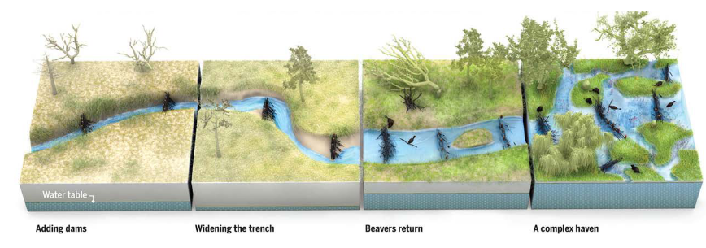

# Beaver Dam Analogs Restoration Sequence

> Figure 1. Illustration of a typical restoration sequence from an incised channel to complex wetland meadow facilitated by Beaver Dam Analogs (BDAs). Adapted from Goldfarb, 2018 figure copyrighted Science by V. Altounian, as adapted by Shahverdian et al 2019.

Source: [Beaver Dam Analog Decision Support
Chehalis Aquatic Species Restoration Plan](https://officeofchehalisbasin.com/wp-content/uploads/2023/01/ASRP_BDA_Decision_Support_Document_5jan2022.pdf)